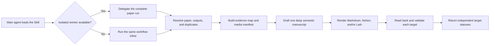

# Open Paper Analysis

[English documentation](docs/en/README.md) |
[中文文档](docs/zh-CN/README.md)

An open, portable Agent Skill for deep, evidence-grounded analysis of one
research paper. It creates one semantic manuscript and renders that same
manuscript to Markdown, Notion, Feishu/Lark, or several targets in one run.

Markdown remains the zero-configuration default and universal fallback.
Notion and Feishu/Lark are first-class native publishing backends rather than
independent rewrites.

## Features

| Capability | Behavior |
| --- | --- |
| One manuscript, many targets | Research judgment, sources, chapters, metrics, limitations, and evidence labels are defined once; only platform rendering differs. |
| Deep by default | Chapters `0-8` exhaust useful evidence without mechanically padding short papers. |
| Isolated subagent execution | A fresh worker owns the complete single-paper workflow when the host supports isolation; the same workflow runs inline otherwise. |
| Paper-type adaptation | Model/method, dataset/benchmark, system/tool, survey/position, and technical-report papers receive different mechanism and evidence structures. |
| Evidence-first analysis | Primary sources feed an evidence map and media manifest before drafting. Every retained Figure/Table receives immediate interpretation and a boundary. |
| Native platform output | Portable Markdown, Notion enhanced Markdown, and Feishu/Lark XML use each platform's native title, headings, contents, properties, formulas, tables, and media. |
| Independent target status | Every target returns `success`, `partial`, or `blocked`; one remote failure never rolls back another artifact. |
| Safe create or update | DOI, arXiv ID, canonical URL, and title matching prevent duplicates; block-aware updates preserve user content and media. |
| Permission-aware media | Marker mode is default. Extraction is limited to open-license, user-provided, or explicitly approved assets. |
| Privacy by design | Public files contain no credentials, private IDs, personal schema, signed media URLs, account data, or local paths. |

## Workflow



The paper is never split into chapters written by separate, partially informed
workers. One agent keeps the analysis coherent; isolated execution is used for
context containment, not fragmented authorship.

## Install

```bash
./scripts/install.sh --target codex
./scripts/install.sh --target claude
./scripts/install.sh --target agents --dest /path/to/project/.agents/skills
```

Use `--dry-run` to inspect the destination and `--force` to explicitly
replace an existing installation. All targets copy the single canonical Skill
under `skills/analyze-paper`.

## Use

```text
Use $analyze-paper to analyze https://arxiv.org/abs/2401.06066 in Chinese.
```

Request several outputs without duplicating research work:

```text
Analyze this paper deeply. Write Markdown and publish the same manuscript to
Notion and Feishu. Use media markers unless an open-license key figure is
essential.
```

Without configuration, the Skill writes
`paper-notes/<paper-slug>.md`. Copy
[config.example.toml](skills/analyze-paper/assets/config.example.toml) to
`.open-paper-analysis.toml` or
`~/.config/open-paper-analysis/config.toml` to set outputs, destinations,
property mappings, or media behavior. Credentials never belong in this file.

## Golden Example

The [DeepSeekMoE golden example](examples/deepseekmoe/README.md) renders one
Chinese model/method analysis to:

- [Portable Markdown](examples/deepseekmoe/markdown.md)
- [Sanitized Notion enhanced Markdown](examples/deepseekmoe/notion.md)
- [Feishu/Lark native XML](examples/deepseekmoe/lark.xml)
- [Shared media and license manifest](examples/deepseekmoe/media.yaml)

It includes six selected CC BY 4.0 visuals, two marker fallbacks, equations,
paper-specific chapters, limitations, and research judgment. Sanitized
body-only screenshots are included for all three targets.

Notion rendering follows the
[official enhanced Markdown format](https://developers.notion.com/guides/data-apis/enhanced-markdown).
Feishu rendering uses the
[official document block model](https://open.feishu.cn/document/server-docs/docs/docs/docx-v1/guide).

## Documentation

- [Getting started](docs/en/getting-started.md)
- [Configuration and v1 migration](docs/en/configuration.md)
- [Output backends and safe updates](docs/en/outputs.md)
- [Quality, media, and safety](docs/en/quality-media-safety.md)
- [Development and verification](docs/en/development.md)

The [Chinese documentation](docs/zh-CN/README.md) mirrors the same guide set.
CI checks both file collections, language navigation, and local links.

## 中文概述

Open Paper Analysis 是一个面向 Codex、Claude Code 和其他兼容 Agent 的
单篇论文深度分析 Skill。它先基于一手来源建立 evidence map，再由同一个
Agent 写出一份完整语义主稿，最后按需渲染为 Markdown、Notion 和飞书文档。
三端共享论文身份、章节、指标、图表编号、局限与研究判断，平台差异只存在
于属性、标题层级、目录、公式、表格和媒体块。

宿主支持子智能体时，主 Agent 会把完整单篇流程交给一个全新隔离 worker，
包括来源解析、查重、分析、写入和读回验证；不会把正文拆给多个 Agent。
没有 worker 时，同一流程在当前 Agent 内执行。

Markdown 是无配置默认，也是任一平台失败后的保底。Notion 采用原生目录和
enhanced Markdown，保持克制的学术笔记风格；飞书使用原生标题、紧凑论文
信息表、标题大纲、公式、图片和表格。每个目标独立报告成功、部分完成或
阻塞，不会因为一个远程后端失败而撤销其他成果。

完整中文指南见[中文文档入口](docs/zh-CN/README.md)，三端效果见
[DeepSeekMoE 示例](examples/deepseekmoe/README.md)。

## Development

```bash
npx --yes skills-ref@0.1.5 validate skills/analyze-paper
python /path/to/skill-creator/scripts/quick_validate.py skills/analyze-paper
python skills/analyze-paper/scripts/validate_note.py examples/deepseekmoe/markdown.md
python skills/analyze-paper/scripts/validate_note.py examples/deepseekmoe/notion.md
python skills/analyze-paper/scripts/validate_note.py examples/deepseekmoe/lark.xml
python scripts/validate_examples.py
python scripts/check_markdown_links.py
python scripts/check_docs_parity.py
bash scripts/test-install.sh
```

See [development guidance](docs/en/development.md) for forward tests, live
Notion/Lark smoke-test hygiene, and release expectations. Claude Code runtime
testing is reported as not run when that client is unavailable; Skill-format
compatibility still remains part of validation.

## Security

See [SECURITY.md](SECURITY.md). CI scans full Git history with Gitleaks and
checks fixtures for credential-shaped values, private target URLs, opaque page
IDs, signed media URLs, and local paths.

## License

Apache-2.0
