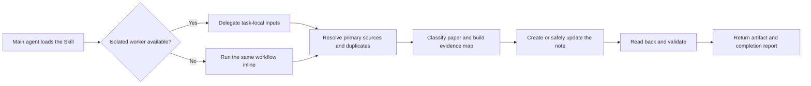

# Open Paper Analysis

An open, portable Agent Skill for evidence-grounded analysis of a single
research paper.

Open Paper Analysis turns an arXiv page, PDF, DOI, title, project page, code
repository, or existing note into a structured Markdown paper note. It keeps
the analysis centered on primary sources, adapts the note to the paper type,
and verifies the finished artifact. Notion publishing is optional.

## Features

| Capability | Behavior |
| --- | --- |
| Isolated subagent execution | Delegates a complete single-paper run to a fresh worker when the host supports isolated agents, keeping PDF and source-file context out of the main conversation. |
| Task-local handoff | Gives the worker only the paper source, original request, output constraints, Skill path, and optional config path. |
| Evidence-first analysis | Builds an evidence map from primary sources before drafting and separates reported results from research judgment. |
| Paper-type adaptation | Uses distinct structures for model/method, dataset/benchmark, system/tool, survey/position, and technical-report papers. |
| Safe create or update | Detects duplicates by DOI, arXiv ID, canonical URL, or exact title and preserves useful user content during updates. |
| Portable output | Produces Markdown with official institution metadata by default and follows the user's language while preserving exact technical names and metrics. |
| Optional publishing | Publishes to Notion through an available connected tool or `ntn`, but falls back to Markdown without blocking the analysis. |
| Read-back verification | Reopens the written artifact and validates metadata, chapters, numbered figure/table evidence, and process-text removal. |
| Privacy by design | Keeps credentials, personal database IDs, local paths, recorder identities, and private property mappings outside the public Skill. |

## Subagent workflow

The Skill delegates one complete paper workflow rather than splitting the paper
across several partially informed agents. The main agent dispatches and
validates the report; the worker owns source resolution, duplicate detection,
analysis, writing, and read-back verification.



This design uses context isolation without making subagents mandatory. A host
that does not expose workers still follows the same analysis and verification
contract in the current agent.

## Example

The repository includes a complete Chinese model/method example:

[DeepSeekMoE: Towards Ultimate Expert Specialization in Mixture-of-Experts
Language Models](examples/deepseekmoe.md)

It is generated from public primary sources only and demonstrates portable
institution metadata, paper-specific mechanism and evidence chapters, numbered
figure/table analysis, limitations, research judgment, and source attribution.
It contains no Notion page ID or personal configuration.

Example request:

```text
Use $analyze-paper to analyze https://arxiv.org/abs/2401.06066 in Chinese.
```

## Install

Install for Codex:

```bash
./scripts/install.sh --target codex
```

Install for Claude Code:

```bash
./scripts/install.sh --target claude
```

Install into a project-level open Agent Skills directory:

```bash
./scripts/install.sh --target agents --dest /path/to/project/.agents/skills
```

Existing installations are protected. Pass `--force` to replace one, or
`--dry-run` to inspect the destination without writing.

## Use

Invoke the Skill explicitly or ask the agent to analyze a paper:

```text
Use $analyze-paper to analyze https://arxiv.org/abs/2607.01233.
```

Unless another destination is requested or configured, the Skill writes
`paper-notes/<paper-slug>.md`. Copy
`skills/analyze-paper/assets/config.example.toml` to
`.open-paper-analysis.toml` or
`~/.config/open-paper-analysis/config.toml` to change defaults or enable
Notion publishing.

## 中文

Open Paper Analysis 是一个开放、可移植的单篇论文深度分析 Skill。它支持
Codex、Claude Code 和其他兼容 Agent Skills 规范的工具，可以从 arXiv、
PDF、DOI、论文标题、项目主页、代码仓库或已有笔记出发，生成经过核验的
结构化 Markdown 论文笔记。

默认输出为 `paper-notes/<paper-slug>.md`，Notion 是可选发布后端，不是
运行前提。公开仓库不包含个人数据库 ID、属性名称或凭据。

核心特性：

- 平台支持时，把完整的单篇论文任务交给全新的隔离子智能体；主 Agent
  只负责最小化任务交接和结果验收。
- 优先读取论文 PDF、源码、会议页面、项目主页和官方仓库，再建立
  evidence map，不根据二手摘要拼接结论。
- 根据模型方法、数据集评测、系统工具、综述观点和技术报告选择不同结构。
- 默认生成带正式单位信息的可移植 Markdown，也可按能力发布到 Notion。
- 写入前查重，更新时保留用户内容，写入后重新读取并运行结构验证。
- 不把凭据、私人数据库 ID、本地路径、记录者和私有属性映射放进公开 Skill。

完整中文示例：

[DeepSeekMoE：迈向终极专家专业化](examples/deepseekmoe.md)

安装到 Codex：

```bash
./scripts/install.sh --target codex
```

安装到 Claude Code：

```bash
./scripts/install.sh --target claude
```

安装到通用项目级目录：

```bash
./scripts/install.sh --target agents --dest /path/to/project/.agents/skills
```

## Development

Validate the Skill and repository:

```bash
npx --yes skills-ref@0.1.5 validate skills/analyze-paper
python /path/to/skill-creator/scripts/quick_validate.py skills/analyze-paper
python scripts/check_markdown_links.py
python skills/analyze-paper/scripts/validate_note.py examples/deepseekmoe.md
bash scripts/test-install.sh
```

Claude Code is not required to use or package the Skill. Runtime behavior
should still be smoke-tested in Claude Code when that client is available.

## License

Apache-2.0
