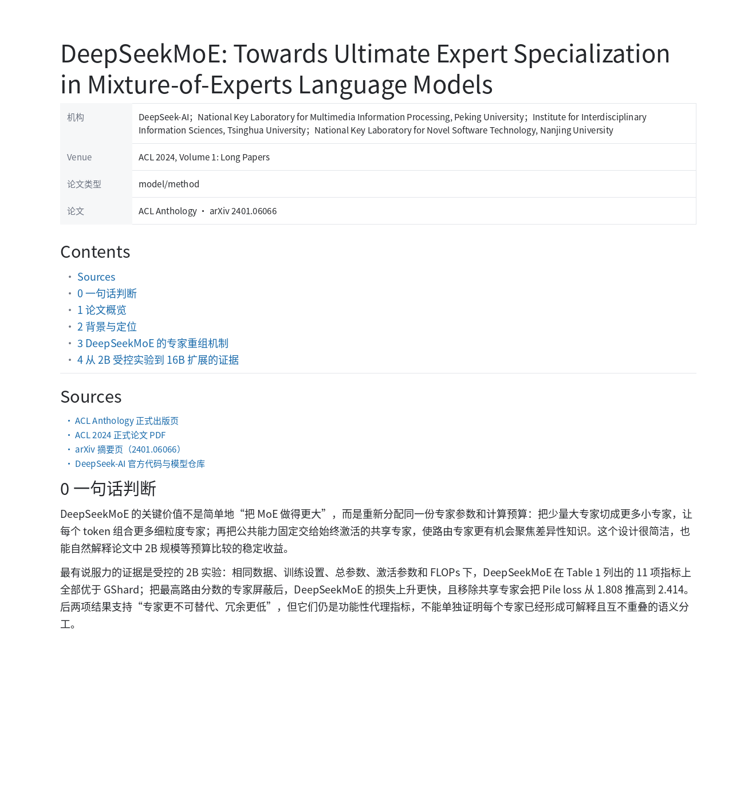
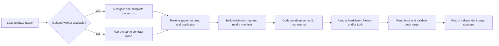

<div align="center">

# Open Paper Analysis

**Read one paper deeply. Publish one verified manuscript everywhere.**

A portable Agent Skill for evidence-grounded research notes in Markdown,
Notion, and Feishu/Lark.

[](https://github.com/wanng-ide/open-paper-analysis/actions/workflows/validate.yml)
[](skills/analyze-paper/SKILL.md)
[](docs/en/outputs.md)
[](LICENSE)

[English](README.md) | [简体中文](README.zh-CN.md) |
[Documentation](docs/en/README.md) |
[Worked example](examples/deepseekmoe/README.md)

</div>

Open Paper Analysis turns a paper, PDF, DOI, title, project page, code
repository, or existing note into one deep semantic manuscript. The same
research judgment is then rendered for one or more platforms without rewriting
the analysis independently for each destination.

> [!IMPORTANT]
> Markdown is the zero-configuration default and universal fallback. Notion and
> Feishu/Lark are optional publishing backends. API keys, OAuth tokens, private
> page IDs, and personal workspace schemas never belong in this repository or
> its configuration file.

## Recommended Agents

The canonical Skill lives at [`skills/analyze-paper/`](skills/analyze-paper/).
Any host that can load an Agent Skills-style directory can use the same source.

| Agent or host | Recommended setup | Project verification |
| --- | --- | --- |
| [Codex](https://developers.openai.com/codex/) | Run `./scripts/install.sh --target codex` | Installer tested in CI; local runtime exercised |
| [Claude Code](https://code.claude.com/docs/en/slash-commands) | Run `./scripts/install.sh --target claude` | Skill format and installer validated; runtime smoke test not run locally |
| [Kimi Code](https://www.kimi.com/code/docs/en/kimi-code-cli/customization/skills.html) | Install to `~/.agents/skills` or a Kimi skills directory | Official loading paths reviewed; runtime not tested in this project |
| [OpenClaw](https://github.com/openclaw/openclaw/blob/main/docs/tools/skills.md) | Install to `~/.openclaw/skills` | AgentSkills-compatible layout reviewed; runtime not tested in this project |
| [Tencent WorkBuddy](https://www.codebuddy.cn/docs/workbuddy/From-Beginner-to-Expert-Guide/Function-Description/Skills-Market) | Import `skills/analyze-paper/` from the Skills interface | Official package-import workflow reviewed; runtime not tested in this project |
| [CodeBuddy IDE/CLI](https://www.codebuddy.cn/docs/cli/skills) | Install to `.codebuddy/skills` or `~/.codebuddy/skills` | Official loading paths reviewed; runtime not tested in this project |
| [OpenCode](https://opencode.ai/docs/skills/) | Install to `~/.config/opencode/skills` | Standard Skill layout; runtime not tested in this project |
| [MiniMax-powered agents](https://github.com/MiniMax-AI/skills) | Use the Skill through a compatible host such as Codex, Claude Code, or OpenCode | Host-dependent; no direct MiniMax Agent runtime claim |
| Other compatible agents | Point the host at `skills/analyze-paper/SKILL.md`, or install with a custom `--dest` | Compatibility depends on the host's Skill loader and available tools |

"Reviewed" means the public loading contract or package structure has been
checked. It does not mean every third-party runtime is covered by this
repository's CI. See [Install for Your Agent](#install-for-your-agent) for exact
commands and the honest verification boundary.

## Quick Start

```bash
git clone https://github.com/wanng-ide/open-paper-analysis.git
cd open-paper-analysis
./scripts/install.sh --target codex
```

Then ask your agent in ordinary language:

```text
Use the analyze-paper skill to analyze https://arxiv.org/abs/2401.06066 in
Chinese. Create a deep Markdown note and keep exact Figure/Table markers.
```

Or request several outputs from the same analysis:

```text
Analyze this paper deeply. Write Markdown and publish the same manuscript to
Notion and Feishu. Use media markers unless an open-license key figure is
essential.
```

Without configuration, a writable run creates
`paper-notes/<paper-slug>.md`. In a read-only environment, the agent returns the
complete Markdown directly. Remote publishing never blocks the Markdown
fallback.

## Worked Example

The [DeepSeekMoE worked example](examples/deepseekmoe/README.md) is a complete
Chinese model/method analysis, not a shortened demo. It shows one manuscript
rendered to all three backends while preserving identity, evidence, chapter
meaning, metrics, limitations, and research judgment.

<p align="center">
  <a href="examples/deepseekmoe/markdown.md">
    
  </a>
</p>

| Target | Overview | Full capture or result | Canonical artifact |
| --- | --- | --- | --- |
| Markdown | [Overview PNG](examples/deepseekmoe/screenshots/markdown.png) | [Complete note](examples/deepseekmoe/markdown.md) | [Portable Markdown](examples/deepseekmoe/markdown.md) |
| Notion | Awaiting a privacy-safe current capture | Awaiting a privacy-safe current capture | [Enhanced Markdown](examples/deepseekmoe/notion.md) and [logical properties](examples/deepseekmoe/notion-properties.json) |
| Feishu/Lark | [Overview JPG](examples/deepseekmoe/screenshots/lark-overview.jpg) | [Full-length JPG](examples/deepseekmoe/screenshots/lark-full.jpg) | [Native XML](examples/deepseekmoe/lark.xml) |
| Evidence | [Media manifest](examples/deepseekmoe/media.yaml) | Six extracted visuals and two markers | [Sources and licenses](examples/deepseekmoe/media.yaml) |

The public captures and fixtures contain no workspace URL, page ID, document
token, signed media URL, credential, account identity, or local path. See the
[full example guide](examples/deepseekmoe/README.md) for the reading path,
cross-target mapping, and screenshot review boundary.

## What It Produces

| Target | Native result | Failure behavior |
| --- | --- | --- |
| Markdown | Portable YAML metadata, visible title, sources, chapters `0-8`, equations, tables, media, and research judgment | Always available as the default or in-response fallback |
| Notion | Live-schema properties, native table of contents, enhanced Markdown blocks, equations, tables, and uploaded media | Returns an offline Notion artifact or Markdown; never blocks other targets |
| Feishu/Lark | Native title, compact paper-information table, heading outline, formulas, tables, images, and block-based document content | Returns XML or Markdown when publication cannot complete safely |

Every requested target reports `success`, `partial`, or `blocked`
independently. A failed remote write does not roll back a successful local note
or another platform.

## Why It Is Different

| Capability | Behavior |
| --- | --- |
| One manuscript, many targets | Sources, claims, sections, metrics, limitations, and evidence labels are defined once; only platform rendering differs. |
| Deep by default | Chapters `0-8` exhaust useful evidence without padding a short or weakly evidenced paper. |
| Coherent subagent execution | When isolated workers are available, one fresh worker owns the complete paper run. The analysis is never fragmented across chapter writers. |
| Paper-type adaptation | Model/method, dataset/benchmark, system/tool, survey/position, and technical-report papers receive different structures. |
| Evidence-first drafting | Primary sources feed an evidence map and media manifest before prose is written. Each retained Figure/Table gets an interpretation and boundary. |
| Safe create or update | DOI, arXiv ID, canonical URL, and title matching prevent duplicates; conservative updates preserve user content and media. |
| Permission-aware media | Marker mode is the default. Extraction is limited to open-license, user-provided, or explicitly approved material. |
| Privacy by design | Public fixtures and configuration exclude credentials, private IDs, personal schemas, signed URLs, account data, and local paths. |

## How It Works



Subagents are used for isolation and context containment, not fragmented
authorship. The worker receives the complete single-paper task, including
source resolution, duplicate detection, analysis, rendering, and read-back
verification. Hosts without isolated workers execute the same contract inline.

## Install for Your Agent

All commands copy the one canonical Skill. `--dry-run` prints the destination;
`--force` is required to replace an existing installation.

**Codex**

```bash
./scripts/install.sh --target codex
```

**Claude Code**

```bash
./scripts/install.sh --target claude
```

**Kimi Code or a shared Agent Skills directory**

```bash
./scripts/install.sh --target agents --dest "$HOME/.agents/skills"
```

**OpenClaw**

```bash
./scripts/install.sh --target agents --dest "$HOME/.openclaw/skills"
```

**CodeBuddy CLI**

```bash
./scripts/install.sh --target agents --dest "$HOME/.codebuddy/skills"
```

**OpenCode**

```bash
./scripts/install.sh --target agents --dest "$HOME/.config/opencode/skills"
```

For Tencent WorkBuddy, import the local `skills/analyze-paper/` directory from
its Skills interface. For any other host, pass the parent skills directory to
`--dest`; the installer creates `<destination>/analyze-paper`.

## Configuration

Configuration is optional. Copy
[`config.example.toml`](skills/analyze-paper/assets/config.example.toml) to
`.open-paper-analysis.toml` or
`~/.config/open-paper-analysis/config.toml`:

```toml
version = 2

[defaults]
outputs = ["markdown"]
language = "auto"
depth = "deep"

[media]
mode = "markers"
max_items = 6
license_policy = "open-or-approved"

[markdown]
notes_directory = "paper-notes"
```

The active request overrides configured outputs, language, and media mode.
Notion and Feishu/Lark destination IDs may be configured, but credentials must
remain in the agent host, connected MCP, or CLI credential store.

## Documentation

- [Getting started](docs/en/getting-started.md)
- [Configuration](docs/en/configuration.md)
- [Output backends and safe updates](docs/en/outputs.md)
- [Quality, media, and safety](docs/en/quality-media-safety.md)
- [Development and verification](docs/en/development.md)
- [Complete Chinese documentation](docs/zh-CN/README.md)

The English and Chinese guide collections are mirrored and checked in CI.

## Repository Layout

```text
skills/analyze-paper/        Canonical portable Skill
docs/en/                     English guides
docs/zh-CN/                  Chinese guides
examples/deepseekmoe/        Three-target golden example
evals/                       Behavioral evaluation cases
scripts/                     Installer and repository checks
tests/                       Validator tests
```

## Verification

The validation pipeline checks the open Agent Skills format, installer matrix,
bilingual documentation, local links, public-artifact privacy, three-backend
fixture consistency, XML syntax, Markdown/Notion structure, media references,
and credential-shaped values. Gitleaks scans full Git history.

```bash
npx --yes skills-ref@0.1.5 validate skills/analyze-paper
python scripts/check_markdown_links.py
python scripts/check_docs_parity.py
python scripts/check_public_artifacts.py
python scripts/validate_examples.py
python -m unittest discover -s tests -v
bash scripts/test-install.sh
```

Claude Code, Kimi Code, OpenClaw, WorkBuddy, CodeBuddy, OpenCode, and direct
MiniMax Agent runtime smoke tests are not currently part of CI. Their status is
kept explicit in the compatibility table instead of being implied by format
compatibility.

## Security

Read [SECURITY.md](SECURITY.md) before publishing fixtures or configuration.
Never commit API keys, OAuth tokens, cookies, private database or page IDs,
personal property schemas, signed media URLs, account details, or local paths.

## License

Open Paper Analysis is released under the [Apache License 2.0](LICENSE).
