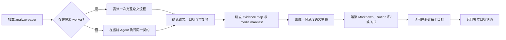

<div align="center">

# Open Paper Analysis

**深度读懂一篇论文，把同一份可靠主稿发布到每个目标。**

一个面向 Markdown、Notion 和飞书文档的可移植论文分析 Agent Skill。

[](https://github.com/wanng-ide/open-paper-analysis/actions/workflows/validate.yml)
[](skills/analyze-paper/SKILL.md)
[](docs/zh-CN/outputs.md)
[](LICENSE)

[English](README.md) | [简体中文](README.zh-CN.md) |
[中文文档](docs/zh-CN/README.md) |
[完整案例](examples/deepseekmoe/README.md)

</div>

Open Paper Analysis 可以接收论文链接、PDF、DOI、标题、项目页、代码仓库或
已有笔记，先形成一份有证据支撑的深度语义主稿，再把同一份研究判断渲染到
一个或多个平台，不为每个目标各写一套逐渐漂移的正文。

> [!IMPORTANT]
> Markdown 是零配置默认和通用保底。Notion 与飞书是可选发布后端。API key、
> OAuth token、私有页面 ID 和个人工作区 schema 都不应进入本仓库或配置文件。

## 推荐 Agent

唯一 canonical Skill 位于 [`skills/analyze-paper/`](skills/analyze-paper/)。
任何能够加载 Agent Skills 风格目录的宿主，都可以使用同一份源文件。

| Agent 或宿主 | 推荐接入方式 | 本项目验证状态 |
| --- | --- | --- |
| [Codex](https://developers.openai.com/codex/) | 运行 `./scripts/install.sh --target codex` | 安装器已通过 CI，本地已实际运行 |
| [Claude Code](https://code.claude.com/docs/en/slash-commands) | 运行 `./scripts/install.sh --target claude` | Skill 格式与安装器已验证，本地未执行 runtime 冒烟测试 |
| [Kimi Code](https://www.kimi.com/code/docs/en/kimi-code-cli/customization/skills.html) | 安装到 `~/.agents/skills` 或 Kimi skills 目录 | 已核对官方加载路径，本项目未执行 runtime 测试 |
| [OpenClaw](https://github.com/openclaw/openclaw/blob/main/docs/tools/skills.md) | 安装到 `~/.openclaw/skills` | 已核对 AgentSkills 兼容目录，本项目未执行 runtime 测试 |
| [腾讯 WorkBuddy](https://www.codebuddy.cn/docs/workbuddy/From-Beginner-to-Expert-Guide/Function-Description/Skills-Market) | 在 Skills 界面导入 `skills/analyze-paper/` | 已核对官方技能包导入流程，本项目未执行 runtime 测试 |
| [CodeBuddy IDE/CLI](https://www.codebuddy.cn/docs/cli/skills) | 安装到 `.codebuddy/skills` 或 `~/.codebuddy/skills` | 已核对官方加载路径，本项目未执行 runtime 测试 |
| [OpenCode](https://opencode.ai/docs/skills/) | 安装到 `~/.config/opencode/skills` | 使用标准 Skill 目录，本项目未执行 runtime 测试 |
| [MiniMax 驱动的 Agent](https://github.com/MiniMax-AI/skills) | 通过 Codex、Claude Code、OpenCode 等兼容宿主使用 | 取决于宿主，不宣称已经验证 MiniMax Agent 原生自定义 Skill 运行时 |
| 其他兼容 Agent | 让宿主读取 `skills/analyze-paper/SKILL.md`，或使用自定义 `--dest` 安装 | 取决于宿主的 Skill loader 与可用工具 |

表中的“已核对”表示公开加载约定或技能包结构已经检查，不等于所有第三方运行
时都纳入了本仓库 CI。准确命令和验证边界见[按 Agent 安装](#按-agent-安装)。

## 快速开始

```bash
git clone https://github.com/wanng-ide/open-paper-analysis.git
cd open-paper-analysis
./scripts/install.sh --target codex
```

然后直接用自然语言要求 Agent：

```text
使用 analyze-paper skill，用中文分析 https://arxiv.org/abs/2401.06066。
生成一份深度 Markdown 笔记，并保留准确的 Figure/Table 编号 marker。
```

也可以从同一次分析发布多个目标：

```text
深度分析这篇论文，生成 Markdown，并把同一份主稿发布到 Notion 和飞书。
默认使用媒体 marker，只有关键图表具备开放许可时才提取。
```

没有配置时，可写环境生成 `paper-notes/<paper-slug>.md`；只读环境直接在回复
中返回完整 Markdown。远程发布失败也不会阻塞 Markdown 保底。

## 完整案例

[DeepSeekMoE 完整案例](examples/deepseekmoe/README.md)是一份完整的中文
model/method 论文分析，不是缩短版 demo。它展示同一份主稿如何渲染到三个
后端，同时保持论文身份、证据、章节语义、指标、局限与研究判断一致。

<p align="center">
  <a href="examples/deepseekmoe/markdown.md">
    
  </a>
</p>

| 输出目标 | Overview | Full 截图或完整结果 | Canonical 工件 |
| --- | --- | --- | --- |
| Markdown | [概览 PNG](examples/deepseekmoe/screenshots/markdown.png) | [完整笔记](examples/deepseekmoe/markdown.md) | [可移植 Markdown](examples/deepseekmoe/markdown.md) |
| Notion | 等待与当前主稿一致的脱敏截图 | 等待与当前主稿一致的脱敏截图 | [Enhanced Markdown](examples/deepseekmoe/notion.md)与[逻辑属性](examples/deepseekmoe/notion-properties.json) |
| 飞书文档 | [概览 JPG](examples/deepseekmoe/screenshots/lark-overview.jpg) | [完整长图 JPG](examples/deepseekmoe/screenshots/lark-full.jpg) | [原生 XML](examples/deepseekmoe/lark.xml) |
| 共享证据 | [媒体清单](examples/deepseekmoe/media.yaml) | 6 个提取图表与 2 个 marker | [来源与许可](examples/deepseekmoe/media.yaml) |

公开截图与 fixture 不包含工作区 URL、页面 ID、文档 token、签名媒体 URL、
凭据、账号身份或本地路径。更详细的阅读顺序、三端对应关系和截图审核边界见
[完整案例指南](examples/deepseekmoe/README.md)。

## 输出内容

| 目标 | 原生结果 | 失败时行为 |
| --- | --- | --- |
| Markdown | 可移植 YAML 元数据、可见标题、来源、`0-8` 章节、公式、表格、媒体和研究判断 | 始终作为默认工件或回复内保底 |
| Notion | 实时 schema 属性、原生目录、enhanced Markdown 块、公式、表格和上传媒体 | 返回离线 Notion 工件或 Markdown，不阻塞其他目标 |
| 飞书 | 原生标题、紧凑论文信息表、标题大纲、公式、表格、图片和块文档正文 | 无法安全发布时返回 XML 或 Markdown |

每个目标独立报告 `success`、`partial` 或 `blocked`。远程写入失败不会撤销
已经成功的本地笔记或其他平台结果。

## 核心特性

| 能力 | 行为 |
| --- | --- |
| 一份主稿，多端输出 | 来源、结论、章节、指标、局限和证据标签只定义一次，只有平台渲染不同。 |
| 默认深度分析 | `0-8` 章节尽可能穷尽有效证据，同时不为短论文或证据薄弱的论文机械扩写。 |
| 连贯的子智能体执行 | 宿主支持隔离 worker 时，由一个全新 worker 负责完整单篇流程，不把章节拆给多个写作者。 |
| 论文类型自适应 | model/method、dataset/benchmark、system/tool、survey/position 和 technical report 使用不同结构。 |
| Evidence-first 写作 | 正文前先建立 evidence map 和 media manifest；每个保留的 Figure/Table 都有解释与边界。 |
| 安全创建或更新 | 通过 DOI、arXiv ID、canonical URL 和标题查重；保守更新会保护用户内容与媒体。 |
| 媒体权限控制 | 默认 marker 模式；只提取开放许可、用户提供或获得明确授权的素材。 |
| 隐私优先 | 公开 fixture 与配置不包含凭据、私有 ID、个人 schema、签名 URL、账号数据或本地路径。 |

## 工作原理



子智能体用于隔离执行和控制上下文，而不是分裂写作。worker 接收完整单篇任务，
包括来源解析、查重、分析、渲染和读回核验。没有隔离 worker 的宿主会在当前
Agent 内执行完全相同的契约。

## 按 Agent 安装

所有命令都复制唯一 canonical Skill。`--dry-run` 只展示目标路径；替换已有
安装必须显式传入 `--force`。

**Codex**

```bash
./scripts/install.sh --target codex
```

**Claude Code**

```bash
./scripts/install.sh --target claude
```

**Kimi Code 或共享 Agent Skills 目录**

```bash
./scripts/install.sh --target agents --dest "$HOME/.agents/skills"
```

**OpenClaw**

```bash
./scripts/install.sh --target agents --dest "$HOME/.openclaw/skills"
```

**CodeBuddy CLI**

```bash
./scripts/install.sh --target agents --dest "$HOME/.codebuddy/skills"
```

**OpenCode**

```bash
./scripts/install.sh --target agents --dest "$HOME/.config/opencode/skills"
```

腾讯 WorkBuddy 可从 Skills 界面导入本地 `skills/analyze-paper/` 目录。其他
宿主可以把 skills 父目录传给 `--dest`，安装器会创建
`<destination>/analyze-paper`。

## 配置

配置是可选的。将
[`config.example.toml`](skills/analyze-paper/assets/config.example.toml)复制到
`.open-paper-analysis.toml` 或
`~/.config/open-paper-analysis/config.toml`：

```toml
version = 2

[defaults]
outputs = ["markdown"]
language = "auto"
depth = "deep"

[media]
mode = "markers"
max_items = 6
license_policy = "open-or-approved"

[markdown]
notes_directory = "paper-notes"
```

当次请求会覆盖配置中的目标、语言与媒体模式。配置可以保存 Notion 和飞书的
目标位置 ID，但凭据必须留在 Agent 宿主、已连接 MCP 或 CLI 凭据存储中。

## 文档

- [快速开始](docs/zh-CN/getting-started.md)
- [配置](docs/zh-CN/configuration.md)
- [输出后端与安全更新](docs/zh-CN/outputs.md)
- [质量、媒体与安全](docs/zh-CN/quality-media-safety.md)
- [开发与验证](docs/zh-CN/development.md)
- [完整英文文档](docs/en/README.md)

中英文指南文件保持镜像，并由 CI 自动检查。

## 仓库结构

```text
skills/analyze-paper/        唯一 canonical Skill
docs/en/                     英文指南
docs/zh-CN/                  中文指南
examples/deepseekmoe/        三端 golden example
evals/                       行为评测用例
scripts/                     安装器与仓库检查
tests/                       验证器测试
```

## 验证

验证流程覆盖开放 Agent Skills 格式、安装矩阵、双语文档、本地链接、公开工件
隐私、三后端 fixture 一致性、XML 语法、Markdown/Notion 结构、媒体引用和
疑似凭据内容。Gitleaks 会扫描完整 Git 历史。

```bash
npx --yes skills-ref@0.1.5 validate skills/analyze-paper
python scripts/check_markdown_links.py
python scripts/check_docs_parity.py
python scripts/check_public_artifacts.py
python scripts/validate_examples.py
python -m unittest discover -s tests -v
bash scripts/test-install.sh
```

Claude Code、Kimi Code、OpenClaw、WorkBuddy、CodeBuddy、OpenCode 和直接
MiniMax Agent 的 runtime 冒烟测试目前不属于 CI。兼容矩阵会明确展示这一
边界，不用格式兼容暗示已经完成运行时验证。

## 安全

发布 fixture 或配置前请阅读 [SECURITY.md](SECURITY.md)。不要提交 API key、
OAuth token、cookie、私有数据库或页面 ID、个人属性 schema、签名媒体 URL、
账号信息或本地路径。

## 许可证

Open Paper Analysis 使用 [Apache License 2.0](LICENSE) 发布。
